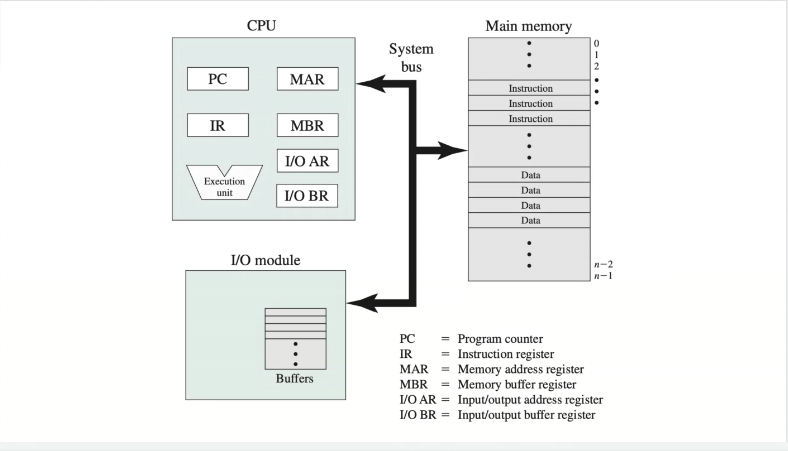
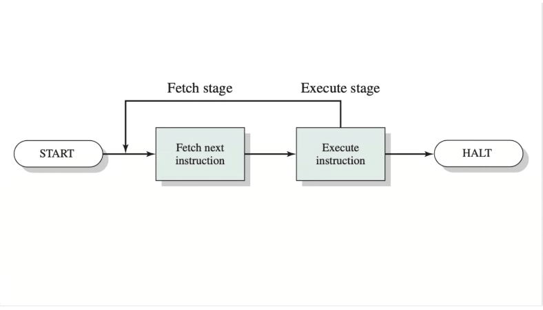
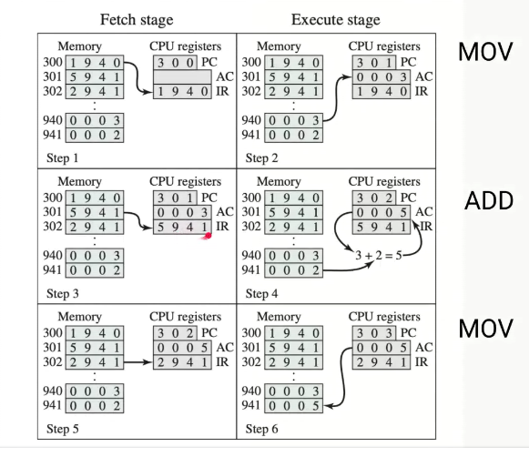
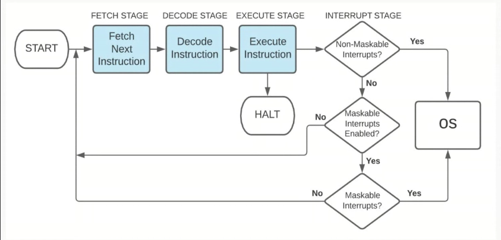

# 00 - Welcome Lecture

## Operating Sistems K3053/K3153

### Content

- Welcome
- Computer Architecure
- Introduction to Operating Systems

### Welcome

- Professor: Esteban Masoero
- Desk Helper: Federico Cardoso
- JTP: Adriano Filgueira

#### Utilities

- [Google Drive](https://drive.google.com/drive/folders/1ZkVYq86wLJ2XvKBbYsi_kLWtqBsRajba?usp=sharing)
- Telegram
- Discord
- [UTNSO](https://www.utnso.com.ar/)

#### Course

- Tuesdays 18.30 - 22.30 (Theory)
- Saturdays 14.00 - 16.00 (Practice)
- Saturdays of Support and Seminaries
- Assignment

#### Evaluation

- Partial Exams, two of them.
- Assignment (party)
  - Oral defense (solo)

#### Bibliography

- Operating Systems: Internals And Design Principles - William Stallings
- Operating Systems Concepts - Silberschatz, Galvin and Gagne

#### Program

- Computer Architecture
- Introduction to Operating Systems
- Process
- Process Scheduling
- Threads
- Concurrency
- Interlocking
- Memory & Virtual Memory
- I/O
- File System

#### Asignment

- Party up to 5
- Intercourse
- A C-program which simulates aspects of Operating Systems
- Technologies: ANSI-C, Linux (Ubuntu)

### Computer Architecture

#### Hardware

We can think the main memory as an Array.

#### Registers

**Visibles to the user**: "general porpouse"

- Modifyables (generally)
- Registers for variables storage: EAX in x86_64

**Control and State**: "controls processor operations"

- Non editables (generally)
- MAR, MBR, I/OAR, I/OBR, PC, IR, PSW: condition codes (flags SZVC), interr. enable/disable, etc.

Following the diagram, **IP** (instruction pointer) aka **PC** (program counter) stores "the _index_" of "_main memory array_" in which the next instruction is located.

Similarly, **MAR** (memory address register) contains the address of the next operand necessary for the instruction, and **MBR** (memory buffer register) contains the value itself.

#### Interruptions

Mechanism which allows I/O modules to interrupt execution flow.

**Classification**

- Maskability
  - Maskable
  - Non-maskable: must be attended
- Origin
  - Hardware: Externals I/O, clock, etc.
  - Software

**Priorities**

