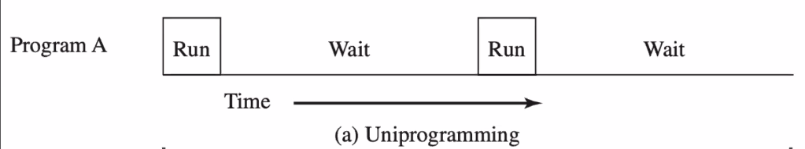
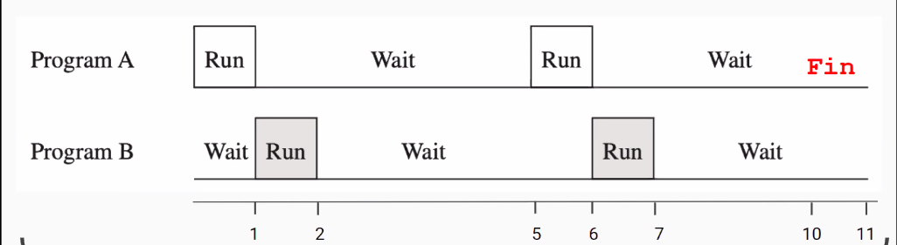
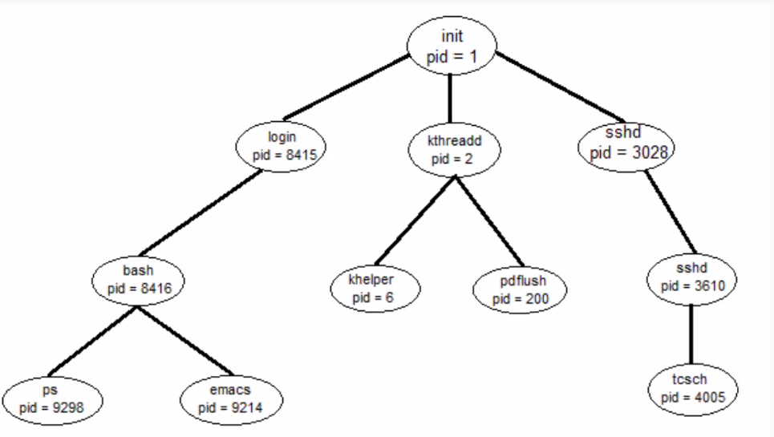

# 01 - Process

## Content

- Revision of [Lecture 0](./00-lecture/README.md)
  - Quick Talk
  - Priviliged Instructions

## Revision

### Quick talk

Harware Revision, registers, execution cycle (fetch-decode-execute) including interrupt stage, interruptions handling (flow), OS & Kernels, definitions of OS, system architecture, securiy (execution mode).

#### Priviliged instructions

Example with this c-snippet.

```c
#include <stdio.h>
#include <signal.h>
#include <unistd.h>
#include <stdlib.h>

void sig_handler(int signal) {
    if (signal == SIGSEGV) {
        puts("received SIGSEGV");
        exit(-1);
    }
}

int main(void) {
    //signal(SIGSEGV, sig_handler);
    puts("I'm about to execute a privileged instruction...");
    sleep(2);
    __asm__ __volatile__ ("cli");
    puts("Was I able to execute the instruction?");
   return 0;
}
```

Compiling with `gcc` and running we get...

```
> I'm about to execute a privileged instruction...
Segmentation fault (core dumped)
```

Investigating with `Valgrind`...

```log
==53444==
==53444== Process terminating with default action of signal 4 (SIGILL): dumping core
==53444== Illegal opcode at address 0x10919D
==53444== at 0x10919D: main (execute_privileged_instruction.c:17)
Illegal instruction (core dumped)
```

Note that if we de-comment `signal(SIGSEGV, sig_handler)`, the function `sig_handler()` is _attached_ to the "_event_" associated with `SIGSEGV`.

Compiling and running...

```
> I'm about to execute a privileged instruction...
> received SIGSEGV.
```

So instead of segmentation fault program exits with `-1`.

If we comment the line `exit(-1)`, we will get something like this...

```
> I'm about to execute a privileged instruction...
> received SIGSEGV.
> received SIGSEGV.
> received SIGSEGV.
> received SIGSEGV.
> received SIGSEGV.
> received SIGSEGV.
...
> received SIGSEGV.
> received SIGSEGV.
> received SIGSEGV.
...
```

Program will "_fire_" the _event_ of `SIGSEGV` endlesly.

<hr>

Syscalls, Wrappers.

## Process

### Smalltakl History of OS

Initally `monoprogramming`. A system could execute only one program at a time.

OS (operating system) as

- Interface betwen system's resources
- Security Agent(illegal resource access, etc)



`Execution time = 20s`

Then `multiprogramming` systems became a thing. They could execute more than one program "_at the same time_".



`Execution time = 11s`

The next improvement was `multiuser` systems. Where multiple programs from different users, were executing concurrently.

For example

<table>
<thead>
  <tr>
    <th>User 1</th>
    <th>User 2</th>
    <th>User 3</th>
  </tr>
</thead>
<tbody>
  <tr>
    <td>Program 1A</td>
    <td>Program 2A<br></td>
    <td>Program 3A</td>
  </tr>
  <tr>
    <td>Program 1B</td>
    <td>Program 2B</td>
    <td>Program 3B</td>
  </tr>
  <tr>
    <td colspan="3" text-align="center" vertical-align="top">OS</td>
  </tr>
</tbody>
</table>

**Advantages**

- Better CPU usage
- Multi-user systems

**Implications**

- Program Monitoring
  - What are they doing?
  - What program is next in execution?
- Control over programs

### Definitions

- Program: Compiled Instructions set
- Concurrent Execution: Execution of more than two programs during a certain time lapse (share or competency for resources).
- Multiprogramming: operation mode in which two or more programs are executing concurrently
- Process:
  - Program in execution time. (systems view)
  - Minimum work-unit of an OS. (functional view)
  - Entity composed (OS designer view)
    - Instructions set (code)
    - Data set (variables, execution stack)
    - A state (execution context, priority, exit status)
    - Attributes set (process id, user id, etc)
    - Assigned Resources (opened files, etc)

### Image of a Process

| Stack |
| :---: |
|  ...  |
| Heap  |
| Data  |
| Code  |
|  PCB  |

- Stack of the system (variable size)
- Heap: dynamic memory (variable size)
- Data: static memory (fixed size)
- Code: instructions
- PCB: OS structure to manage the process

Example

```c
/**
 * Commented the image position @Position
 * All the code itself is in @CODE
 */
int initial_value = 1; //@DATA

int main(void)
{
    int total = sum(initial_value, 2); //@STACK
    char *message = calloc(sizeof(char), 30); //@HEAP
    sprintf(message, "Total %d", total);
    puts(message);
}

int sum(int value1, int value2)  //@STACK
{
    int result = value1 + value2; // @STACK
    return result; //@STACK
}
```

### PCB

Process Control Block

- Process **ID**: PID, PPID, UID
- Processor Status:
  - User-visible registers (AX, BX, etc)
  - Control registers (PC, IR, FLAGS)
  - Stack pointers
- Proces **Control**
  - Scheduling: status(READY, RUNNING, etc), priority, quantum, wait event.
- **Memory**: code/data segment's pointer
- **Assigned Resources**: files/semaphores, etc.

### Execution Example

| Process 1 | Process 2 |
| :-------: | :-------: |
|     i     |     a     |
|     j     |     b     |
|     k     |     c     |

Gantt's Diagram

|  Process  |     |     |     |     |     |     |     |     |     |
| :-------: | --- | --- | --- | --- | --- | --- | --- | --- | --- |
|    So     |     |     | x   |     |     | x   |     | x   |     |
| Process 1 |     |     |     | i   | j   |     |     |     | k   |
| Process 2 | a   | b   |     |     |     |     | c   |     |     |
|           | 0   | 1   | 2   | 3   | 4   | 5   | 6   | 7   | 8   |

### Cycle of life

- Who creates them?
  - OS
  - Another process
- Who kills them?
  - OS
  - Another process
  - Itself
    - Normal exit
    - Abnormal exit

Example, linux process tree:



When a process die, their sons changed their parent to the dead process' parent, recursively.

Other considerations

- Isolated
  - No resource sharing between each other
  - OS dependant to share resources or communicate (IPC)
- Independent
  - No need to know another process existence
