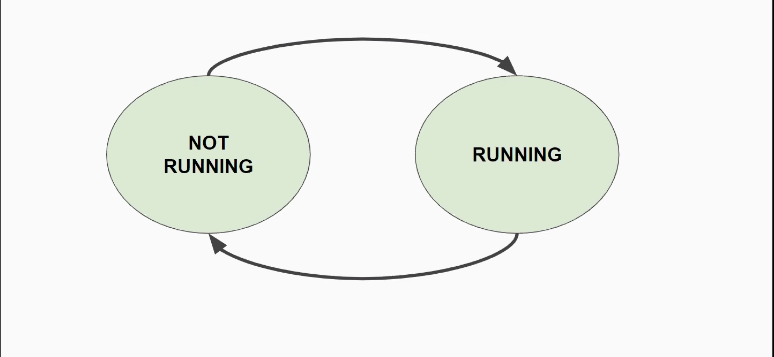
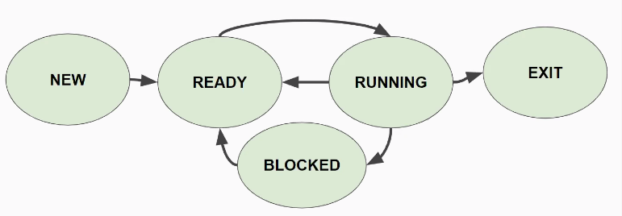
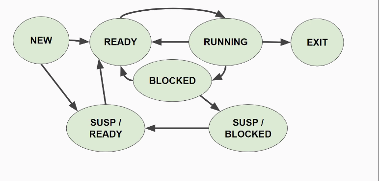

# 02 - Process

## Content

- Life cycle
  - 2 States
  - 5 States
  - 7 States
- Status in Linux
- Syscalls and Process blocking

## Process

### Life Cycle

**2-state Diagram**



**5-state Diagram**



**7-state Diagram**



Even though the `process` is _suspended_, `PCB` is **never** on disk, always on memory until process _exists_.

### Status in Linux

When running `ps`

```
D:    uninterruptible sleep (usually IO)
R:    Running or runnable (on run queue)
I:    Idle kernel thread
S:    interruptible sleep (waiting for an event to complete)
T:    stopped by job control signal
t:    stopped by debugger during the tracing
W:    paging (not valid since the 2.6.xx kernel)
X:    dead (should never be seen)
Z:    defunct ("zombie") process, terminated but not reaped by its parent
```

|                                        | Blocking |             Non-blocking             |
| :------------------------------------- | :------: | :----------------------------------: |
| Operation can be executed immediatly   | Operates |               Operates               |
| Operation may take a while (undefined) |  Blocks  | No operates, but continues execution |
| Return values                          | OK/ERROR |           OK/ERROR/RE-TRY            |
