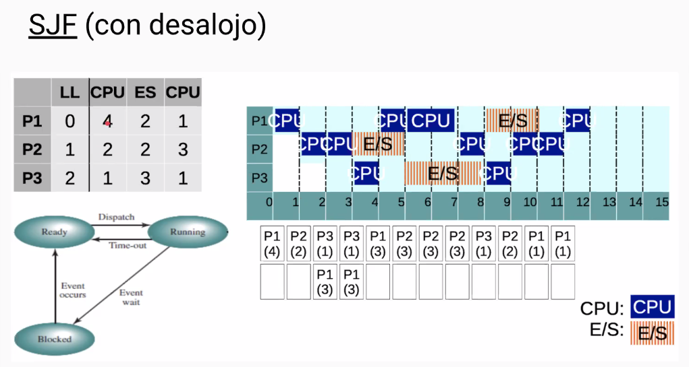
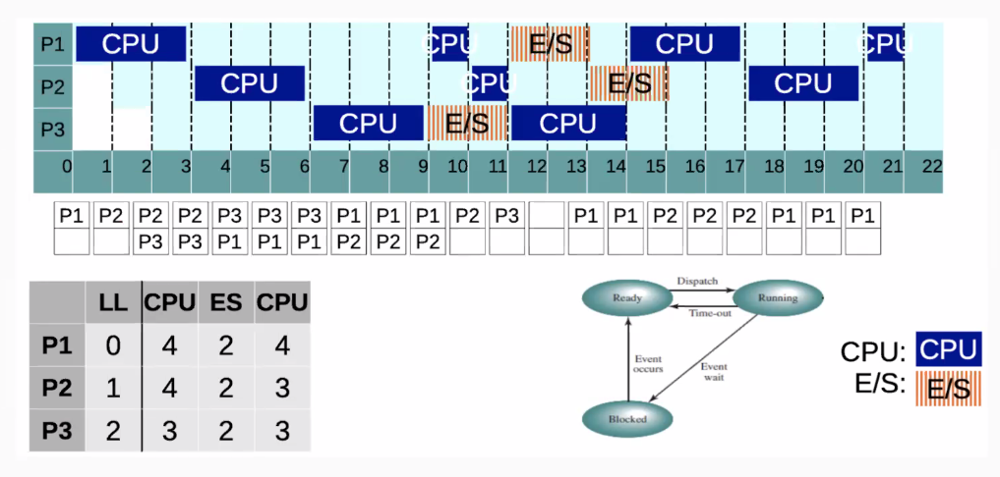

# 03 - Scheduling

## Content

- Scheduling
  - Types
    - LTS
    - MTS
    - STS
  - Multiprogramming
- Criteria to evaluate Schedulers
  - Gantt's diagram
- Scheduling Algorithms

## Scheduling

As with **multiprogramming** we want to get it best, many process are created.
As resource `CPU TIME` is limited. We need an efficient multiprogramming.

It is **key** to have some sort od coordination: `Scheduling`.

### Long Term Scheduler (LTS)

Dedices wheter a process will be admited at `Ready Queue` (or _Ready/suspended_).

### Medium Term Scheduler (MTS)

Decides wether to suspend a process in both suspended queue.

Both `LTS` and `MTS` define how _loaded_ the system is.
Relevants on critical systems.

<hr>

### Multiprogramming Level

The number of active process in memory. Refers to how much _stressed_ the system is.

<hr>

### Short Term Scheduler (STS)

Decides which of the ready, in-memory processes is to be executed.

> NOTE: Stallings states that STS is the Dispatcher

- Executes with greater frequency
- Essential for multiprogramming
- Executes when OS is requested
  - Interuptions
  - Syscalls

## Criteria to evaluate Schedulers

<style type="text/css">
.tg  {border-collapse:collapse;border-spacing:0;}
.tg td{border-color:black;border-style:solid;border-width:1px;font-family:Arial, sans-serif;font-size:14px;
  overflow:hidden;padding:4px 17px;word-break:normal;}
.tg th{border-color:black;border-style:solid;border-width:1px;font-family:Arial, sans-serif;font-size:14px;
  font-weight:normal;overflow:hidden;padding:4px 17px;word-break:normal;}
.tg .tg-baqh{text-align:center;vertical-align:top}
.tg .tg-nrix{text-align:center;vertical-align:middle}
</style>
<table class="tg">
<thead>
  <tr>
    <th class="tg-baqh"></th>
    <th class="tg-baqh">Benefits</th>
    <th class="tg-baqh">Other Criteria</th>
  </tr>
</thead>
<tbody>
  <tr>
    <td class="tg-nrix">Process<br>User<br>Oriented<br></td>
    <td class="tg-nrix">Execution Time<br>Waiting Time<br>Response Time</td>
    <td class="tg-nrix">Predictability<br></td>
  </tr>
  <tr>
    <td class="tg-nrix">System<br>Oriented<br></td>
    <td class="tg-nrix">Throughput<br>CPU Usage<br></td>
    <td class="tg-nrix">Equity<br></td>
  </tr>
</tbody>
</table>

### Gantt Diagram


See how in the first Diagram:

```
Waiting Time (A)    = 0
Waiting Time (B)    = 2
Waiting Time (C)    = 4
```

```
Waiting Time (A)    = 12
Waiting Time (B)    = 0
Waiting Time (C)    = 2
```

## Scheduling Algorithms

### First Come First Served (FCFS or FIFO)

First process which arrives to the ready queue is also the first one selected to be executed. And is executed until is blocked. (Non-preemtive)


- Ignoring OS CPU time.
- Table is an execution trace.
- CPU burst vs I/O burst.
- Priority: arrive time.

### Shortest Process Next (SPN or SJF)

Shortest Job, in the ready queue is the Next to be executed.


This algorithm may cause `starvation` for long CPU burst process. As it is Non-preemptive.

In real life it needs an _estmiation_ to _know_ whay process goes next.

#### Exponential average


```
TE_n      =   current Burst REAL execution time
EST_n     =   current Burst ESTIMATED time
EST_n+1   =   next Burst ESTIMATED time
alpha     =   constant between 0 and 1
```

An `alpha` closer to `1` prioritizes to the latest behaviour `TE_n`. An alpha closer to `0` prioritizes the _record_. Knowing a process is stable, an alpha closer to 0 will be ideal.

### Shortest Remaining Time (SRT or preemptive SJF)

Shortest Job Next using a preemtive policy. Which means a superior `turnaround time` _(TAT)_.

**TAT**: time interval from the time of submission of a process to the time of the completion of the process. It can also be considered as the sum of the time periods spent waiting to get into memory or ready queue, execution on CPU and executing input/output.



### Round Robbin (RR)

Is a preemptive algorithm, which defined a `quantum`, establishes a maximum for busrt length.

In the image below, `quatum = 3`. Priorities in the `ready queue` are determined by `FIFO`



### Virtual Round Robbin (VRR)

Uses an `auxiliar ready queue` with greater priority than the regular `ready queue`. With this process which do not finish their quantum, as they got blocked.

This _saves_ the quantum for blocked process. So they got now an _auxiliar quantum_ equals to the remaining cpu burst.

`Quantum_auxiliar = Quntum - executed Quantums`

**NOTE**: both queues have a FIFO priority.

### Highest Response Ratio Next (HRRN)

Non preemptive algorithm which takes into account `aging`.

`R = w+s / s`

```
R   =   response ratio
w   =   waiting time in ready queue
s   =   service time
```

### Multi-level

Multiples queue with different priorities, which they may or may not implement different algorithms.

#### Multi-level feedback

Preemptive with clock interruption, lowering its priority.

## Classification

### Non-Preemptive

OS gets involved, when:

- Syscall
- Process ends

examples: FIFO, HRRN, SNP, Multi-level.

### Preemtive

OS gets involved, when:

- Syscall
- Process ends
- Process with greater priority
  - New -> Ready
  - Blocked -> Ready
  - Timeout

examples: SRT, RR, VRR, Multi-level.

## Conventions

For this course we will apply this priorities when handling the `new queue`

1. Clock interrupt: CPU
2. Event finish: interruption due to event finished.
3. Syscall: new process, etc.
