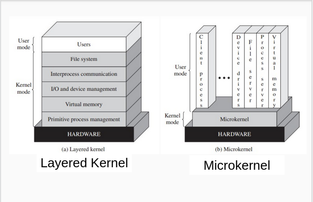

# 04 - Threads & Micro Kernels

## Content

- Threads
  - FTP server
- Kernel

## Threads

Efficent multi-programming

### Single to multiple threads models

Take a _File Transfer Protocol_ (FTP) server, as an example. It makes remote operation over files: create, reade, update and delete.


Possible approach.

```js
while(true){
    var cmd = receive_request();
    switch(cmd){
        case "ls": list_files();
        case "get": send_content();
        ...
    }
}
```

This design has problems when attending multiple processes, as it can only handle one at a time.

#### Revision I

```js
// Coordinator
while (true) {
  accept_new_client();
  launch_process(cmd);
}

// Client Handler 1
while (true) {
  recv_command();
  process_command();
}

// Client Handler 2
while (true) {
  // Another command
  recv_command();
  process_command();
}
```

**Benefits** of the implementation above:

- Better design, greater modularity
- Easy to understand and maintain
- Friendly multi-process

**Observations**:

- Stats sending via Inter Process Communication (IPC)
- Multiple File descriptors
- Many process spawning.
- Code reutilization: requieres advance use of OS libraries.

#### Revision II

We had in common:

- Code copy
- File descriptor open many times
- Need of information sharing

Then we could:

- Code sharing
- Resourse sharing
- Memory sharing
- Launch multiple threads to create multiple "paths" of execution


**PROS**

- Create/Destroy threads
- Thread switch (between threads of the same process)
  - Why? Memory shared space does not change.
- Communication between threads
  - Why? OS interventions is almost NULL.
  - How? shared memory "_out of the box_".

**Problems**

- Need of syncronized shared resources. Otherwise, inconsistencies are generated.

## Threads Types

### Kernel Level Threads (KLTs)

- Managed by Kernel
- Short Term Scheduling

**PROS**:

- Two or more threads can be executed in different processors.
- If one thread gets blocked, the other can continue their execution.

**Problems**:

- Overhead: mode switch.

### User Level Threads (ULTs)

- Managed by a _library_.
- Double scheduling, OS level and thread level.

**PROS**

- Least overhead: managed without mode switch.
- Scheduling specifinc of the library.
- Portability.

**Problems**

- Threads cannot be executed in different threads.
- If one thread gets blocked, none of them can continue.

#### Syscalls Interception

- Gives more options of management to the library
- Supedited to programmer election: insted of `read()` use `user_thread_read()`.

#### Jacketing

Transforms blocking syscalls into non-blocking.

- Thread blocked will not block the others.
- Library must intercept all syscalls.

### KLTs & ULTs

Using them togethe to obtain benefits from both.

- Multiprocessing from KLTs
- Low overhead from ULTs
- Useful for processes with highly differentiable tasks:
  - CPU bound (KLT: as _CPU_, many ULTs)
  - I/O bound (KLTs: I/O)

### Technical comparison


## Kernel's Architecture

### Monolithic


### Layered and Microkernel


