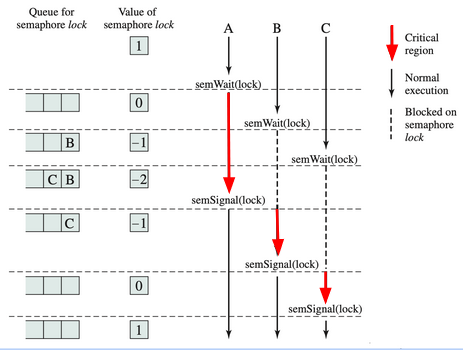
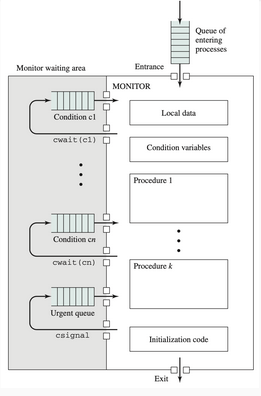

# 05 - Concurrency and Sincronization

## Content

- Race condition

## Race condition

Suppose

```c
int counter = 0;

// THREAD A ---------------
for( i = 0; i < 1000 ;i++ )
  counter++;
// _________________________


// THREAD B ---------------
for( i = 0; i < 1000 ;i++ )
  counter++;
// _________________________

```

> Will the final value of counter be 2000?

_Answer_: not necessarily.

Then:

**Race Condition** is the situation in which multiple processes / threads modify shared data, and the final value of the same depends on the speed of their execution (which can produce inconsistent values ​​for both).

## Concurrency

### Types

- **Multiprogramming**: refers to the manage of multiple processes in memory .
- **Mutiprocessing**: refers to the manage of multiple processes in a multriprocessor system.
- **Distributed processing**: refers to the management of multiple processes on multiple distributed computers.

### Why?

- **Performance**: due to multiprogramming.
- **Structurated application**: design driven. A program may be defined as a set of processes or concurrent threads.

### Iteration forms

|                      |          Coupling          | Resourse Managament |
| :------------------- | :------------------------: | :-----------------: |
| Competency           | Unknowledge of contestants |         OS          |
| Indirect cooperation |      Knows existance       |   Process/Thread    |
| Direct cooperation   |      Knows existance       |   Process/Thread    |

### Conclussions

- The relative speed of processes can never be predicted.
- The speed of processes cannot be relied upon to assume "_atomicity_" of certain operations.

## Critical Section

```
  <Irrelevant section>
          ...
<Begin of Critical Section>
    <Critical section>
<End of Critical Section>
          ...
  <Irrelevant section>
```

Is the code section where threads will use shared resources.

For example, continueing the `counter` problem...

```c
int f(void){
//...
wait_my_turn();
counter++;
end_my_turn();
//...
}
```

### Mutual exclusion

Requirement by which it is said that while a process is in a critical section to use a resource, no other process must be able to access its critical section to use that same resource.

**Exclusive requirements**

1. Mutual exclusion
2. Limited wait (neither _deadlock_ nor _starvation_)

**Considerations** (_desirable ascpects_)

- Process NOT in critical section (_CS_) does not interfer in anyway with others.
- Immediate admission for _CS_ when no process on it.
- The permanence in the _CS_ must be for a finite and reduced time

**Possible Solutions**

- Software

  - Global variables, conditions and algorithms

- Hardware

  - Disable interruptions
  - Special instructions

- OS

  - Semaphores
  - Monitors

#### Software

**First attempt**

```c

// Process 0
void f(){

  while( turn != 0){
  /* do nothing*/;
  }
  /* Critical section */;

turn = 1;
}

// Process 1
void g(){

  while( turn != 1){
  /* do nothing*/;
  }
  /* Critical section */;

turn = 0;
}
```

The **elephant in the room** is the _Busy Waiting_ (_spinning_), where a thread evaluates continuosly if the condition is true or not, ocuppying the processor in this interval.

**Bad practice** (_most cases_)

- Compliance with the condition does not depend on how many times it has been evaluated, but generally on external factors
- Busy CPU time is not useful processing (could be used by another process)

**Second attempt**

```c
bool flag[2] = {false, false};

// Process 0
void f(){

// is Process 1 in CS?
  while( flag[1]){
  /* do nothing*/;
  }

flag[0] = true;
  /* Critical section */;
flag[0] = false;

}

// Process 1
void g(){

// is Process 0 in CS?
  while( flag[0]){
  /* do nothing*/;
  }

flag[1] = true;
  /* Critical section */;
flag[1] = false;

}
```

**Third attempt**

```c
bool flag[2] = {false, false};

// Process 0
void f(){

flag[0] = true;

// is Process 1 in CS?
  while(flag[1]){
  /* do nothing*/;
  }
  /* Critical section */;
flag[0] = false;
}

// Process 1
void g(){

flag[1] = true;
// is Process 0 in CS?
  while(flag[0]){
  /* do nothing*/;
  }
  /* Critical section */;
flag[1] = false;
}
```

As both flags are set true before, a _Deadlock_ may occur.

**Fourth attempt**

```c
bool flag[2] = {false, false};

// Process 0
void f(){

flag[0] = true;

// is Process 1 in CS?
  while(flag[1]) {
    flag[1] = false;
    /* delay */;
    flag[1] = true;
  }
  /* Critical section */;
flag[0] = false;
}

// Process 1
void g(){

flag[1] = true;
// is Process 0 in CS?
  while(flag[0]){
    flag[0] = false;
    /* delay */;
    flag[0] = true;
  }
  /* Critical section */;
flag[1] = false;
}
```

Now this attempt may cause _Live lock_.

##### Conclussions

- Overhead
- Tends to error messages

Mutual exlusion guaranteed:

- Dekker's algorithm
- Peterson's algorithm

#### Hardware

**Disable interruptions**

```c
while(true){
  // disable interruptions
  // critical section
  // enable interruptions
  // remainder
}
```

Downgrades performance,inefficent for multiprocessing systems.

**Special instructions** _compare and swa_

```c
int compare_and_swap(int *word, int testval, int newval)
{
  int oldval;
  oldval = *word;
  if(oldval == testval) *word = newval;
  return oldval;
}
```

> NOTE: this is not a real _C function_. It is an instruction.

Then

```c
void process_0(){
  while(c_a_s(&cr_status, FREE, BUSY) == BUSY){
    // Do nothing
  }
  // Critical section
  cr_Status = FREE;
}

void process_1(){
  while(c_a_s(&cr_status, FREE, BUSY) == BUSY){
    // Do nothing
  }
  // Critical section
  cr_Status = FREE;
}
```

**atomic incremet**

```c
atomic_increment(&counter);
```

Useful in specific use cases, tipically basic aritmethic.

#### OS

- Minimun busy waiting
- Simple to use and understand
- Mechanims of task execution coordination within processes/threads

**Semaphores**

Is an integer variable, which can only be accessed through the functions: wait () and signal () (and those necessary to initialize, delete, etc).

These operations are assumed to be atomic (they cannot be interrupted, or if they are interrupted the state they were handling does not change in any way)

```c
struct Semaphore{
  int count;
  queueType queue;
};

void semWait(semaphore s){
  s.count--;

  if(s.count <0){
    // Place this process in s.queue
    // block this queue
  }
}


void semSignal(semaphore s){
  s.count--;

  if(s.count <= 0){
    // remove a process from s.queue
    // place that process on ready list
  }
}
```



```c
semaphore task_1_complete  = 0;

void thread_1(){
  do_task1();
  signal(task_1_complete);
}

void thread_2(){
  wait(task_1_complete);
  do_task_2();
}
```

##### Value interpretation

- (> 0): amount of available instances of that resource\
- (< 0): the |value| refers to amount of processes/threads waiting
- (= 0): no available and noone waiting

**Types of semaphores**

- Counter / General
- Binary
- Mutex

**Order in blocked queue**

- FIFO: fairer
- other: ex. priorities
- Order is not guaranteed
  - windows' mutexs API warns of not assume FIFO.

By default: we will assume FIFO.

**Monitors**

Rules

1. Local data (shared) only accesible by monitor procedures
2. A process enters monitor by invoking one of its procedures
3. Only one process can enter the monitor at a time



Observations

- Simpler than semaphores
- They depend on some paradigm that provides encapsulation
- They serve for mutual exclusion and to coordinate tasks
