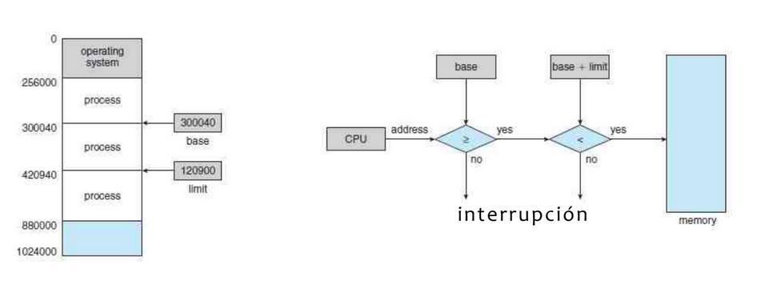
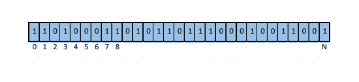

# 06 - Real Memory

## Content

- Introduction
- Requirements

## Introduction

To execute a program, it has to be loaded to memory as a process. This memory (RAM) is a vector (large) managed by the OS.
The memory does not know its content.

## Requirements

- Reubication
- Protection:

  Register base + limit.

  

- Sharing
- Physcis and Logic organization

## Physical and Logic Addresses

- **Logical**: reference of a memory addrss used by processes, Independent from real memory.
- **Relative**: A logical address which is expressed according to a known point.
- **Absolute or Physycal**: references a _REAL_ memory location.

## Memory Assigmnet for Processes

### Fixed Partition

- Memory is divided in partitions of fixed size.
- A process is assigned a partition of its size or smaller.
- Two schemes:
  - All partitions the same size.
  - Partitions of different sizes.

### Dynamic Partition

- If memory is available, each process is allocated the memory you need.
  - There is no fixed number of partitions.

#### Algorithms

- **First fit**: Searches for the first available gap from the memory beginning
- **Next fit**: Searches for the first available gap from the position of the last assignment.
- **Best fit**: Find the smallest gap where it can fit the process.
- **Worst fit**: Find the largest gap where it can fit the process.

### Buddy System

- Compensates for disadvantages of fixed partitioning and dynamic.
- Processes are assigned memory sizes that are powers of two (_2^n_)
- The memory allocated is according to the size of the process and is rounded to the next power of two.

## Segmentation

- The process does not need to be contiguous in memory.
- The process is divided into size segments variable.
- Each segment represents a part of the process from the vision of the programmer.
  - Code.
  - Stack.
  - Data.
  - Library.
  - Heap.

## Pagination

- The process does not need to be contiguous in memory.
- Processes and memory are divided into parts of the Same size.
- The processes are divided into pages.
- Memory is divided into frames.

### Table of free frames

- Structure to determine which memory frames
  is free
- Example of a frame bitmap:

## Segmented Pagination

- Segments are paginated.
- Combines advantages of segmentation and pagination.
