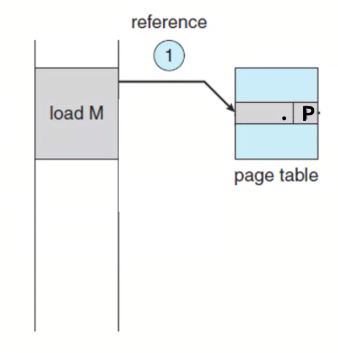
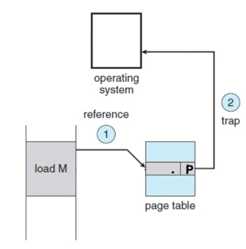
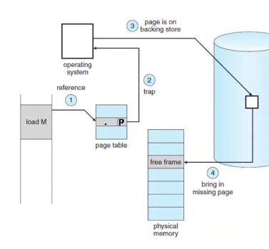
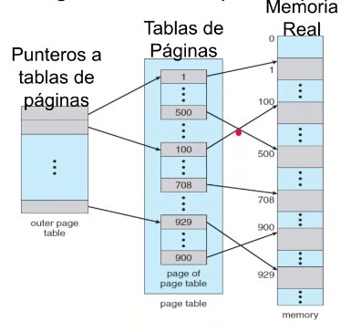
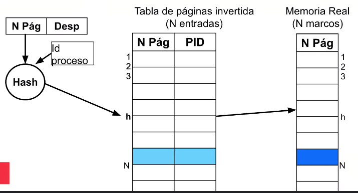
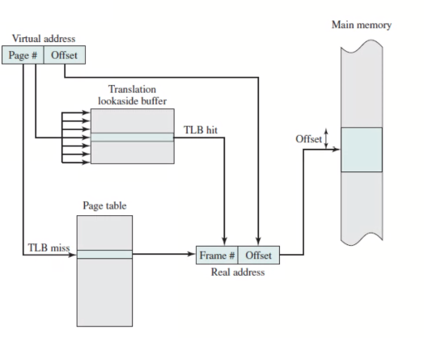

# 07 - Virtual Memory

## Contet

## Virtual Memory

### Definition

- Secundary memory space (disk) which can be addressed as it was real memory

### Features

- Address translation

### Motivations

- During process execution, not all parts (pages or segments) are used
- Reserved unused space
- Not memory occupation with unused parts (pages or segments)

### Advantages

- Allows bigger process than real memory
- More processes in memory: **higher multiprogramming grade**

### Translation mechanisms

1. Reference to memory
   - Verify the **P**resency of page in memory
   - Page fault

> NOTE: Virtual memory must be supported by Hardware



2. Interruption
   - Blocks process
   - Meanwhile another process makes CPU usage



3. Page request

   - Determines which frame to ubicate the missing page
   - Ask if frame contains a modified page (written)
     - Save copy in disk (update)
   - Request missing page (I/O)

4. Loads page in memory
   - Interruption in order allowing OS to take control;



5. OS handles Interruption

   - Updates page's table
   - Unblocks process (changes status to _Ready_)

6. Executes again the instruction which `Page Faulted`


### Table of Pages structure

```
Logic Address
// -----------
    3  |  214
// -----------

Physic Address
// -----------
    1  |  214
// -----------
```

Requieres an access to disk for each writting and reading

### Efficiency

- Requieres more memory access
- Requieres more disk access
- Does not improves performance for the process execution

#### Principle of Locality or Proximity

- Allows virtual memory without performance loses

### Otther Table Structures

- Pages usally have a size of `2^n`

> Example `4KiB` size

```
|   Size    |   214 |
```

#### Jerarchy or Levels



#### Inverted Table of Pages

- Unique table for all the process



> NOTE: there is more information about this but it is **NOT** relevant

#### Translation Lookaside Buffer (TLB)

- Hardware Support
- Improves performance in translation of addresses
- It **may** reduce the amount of memory access
- Cache for Table of Pages


