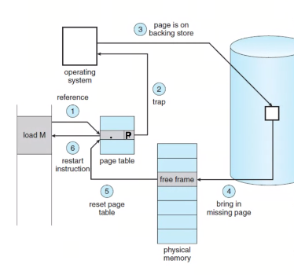

# 07 - Virtual Memory

## Contet

## Virtual Memory

### Definition

- Secundary memory space (disk) which can be addressed as it was real memory

### Features

- Address translation

### Motivations

- During process execution, not all parts (pages or segments) are used
- Reserved unused space
- Not memory occupation with unused parts (pages or segments)

### Advantages

- Allows bigger process than real memory
- More processes in memory: **higher multiprogramming grade**

### Translation mechanisms

1. Reference to memory
   - Verify the **P**resency of page in memory
   - Page fault

> NOTE: Virtual memory must be supported by Hardware


2. Interruption
   - Blocks process
   - Meanwhile another process makes CPU usage


3. Page request

   - Determines which frame to ubicate the missing page
   - Ask if frame contains a modified page (written)
     - Save copy in disk (update)
   - Request missing page (I/O)

4. Loads page in memory
   - Interruption in order allowing OS to take control;


5. OS handles Interruption

   - Updates page's table
   - Unblocks process (changes status to _Ready_)

6. Executes again the instruction which `Page Faulted`



### Table of Pages structure

```
Logic Address
// -----------
    3  |  214
// -----------

Physic Address
// -----------
    1  |  214
// -----------
```

Requieres an access to disk for each writting and reading

### Efficiency

- Requieres more memory access
- Requieres more disk access
- Does not improves performance for the process execution

#### Principle of Locality or Proximity

- Allows virtual memory without performance loses

### Otther Table Structures

- Pages usally have a size of `2^n`

> Example `4KiB` size

```
|   Size    |   214 |
```

#### Jerarchy or Levels


#### Inverted Table of Pages

- Unique table for all the process


> NOTE: there is more information about this but it is **NOT** relevant

#### Translation Lookaside Buffer (TLB)

- Hardware Support
- Improves performance in translation of addresses
- It **may** reduce the amount of memory access
- Cache for Table of Pages


### Operating System design

> Stallings: Operating System - Section 8.2

- Hardware
  - Supports (or not) virtual memory
  - Supports (or not) pagination

#### Policies

##### Fetch

- Demand paging
- Prepaging

##### Placement

- Pure segmentation
  - Algorithms (Best Fit, First fit, Next fit, Worst fit)

#### Replacement

- Frames blocking

  > Some of the frames in main memory may be locked. When a frame is locked, the page currently stored in that frame may not be replaced. Locking is achieved by associating a lock bit with each frame. This bit may be kept in a frame table as well as being included in the current page table.

##### Algorithms

- **Optimal**
  - selects for replacement that page for which the time to the next reference is the longest (or does not exist)
  - It can be shown that this policy results in
    the fewest number of page faults
- **First-in-first-out** (_FIFO_)

  - treats the page frames allocated to a process as a circular buffer, and pages are removed in round-robin style.

- **Least recently used** (_LRU_)

  - replaces the page in memory that has not
    been referenced for the longest time
  - By the **`Principle of Locality`** , this should be the
    page least likely to be referenced in the near future

- **Clock**
  - The simplest form of clock policy requires the association of an additional bit with each frame, referred to as the use bit.
- **Improved Clock**
  - Requieres
    - Pointer to next frame
    - Double bit (used and modified)
  - Algorithm
    - Searches for bits `u=0 m=0` not used and not modified
      - Does not mark usage bit during first iteration

##### Considerations

- Overpagination / Trashing

More processes in memory and less frames per process `->` More **Page Faults** `->` Lower CPU usage `->` Increases **multiprogramming grade**

#### Resident Set Management

> The `Resident Set` is the portion of a process that is actually in main memory at any time is defined to be the resident set of the process.
> 

> NOTE: It is not possible as long as process are not at maximum

#### Cleaning

A cleaning policy is the opposite of a fetch policy; it is concerned with determining when a modified page should be written out to secondary memory.

- Demand cleaning
  > a page is written out to secondary memory only when it has been selected for replacement.
- Precleaning
  > writes modified pages before their page frames are needed so pages can be written out in batches.

#### Considerations

- Page sharing (copy during writting)
  - Pagination allows memory share
  - `fork()`
