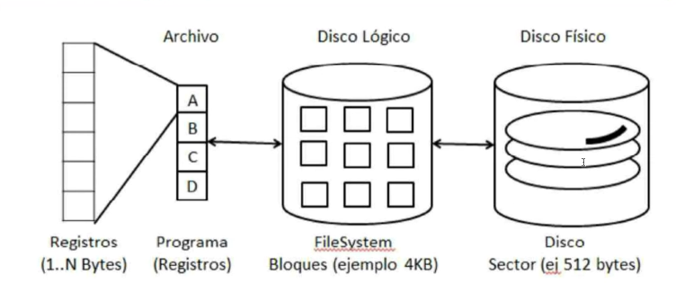
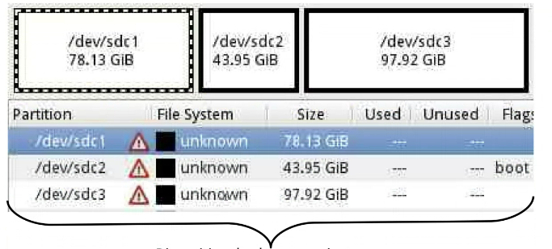
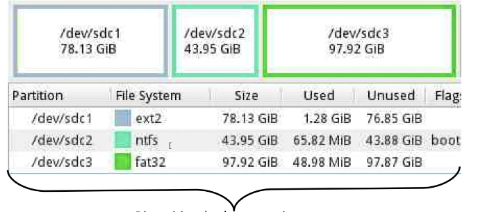
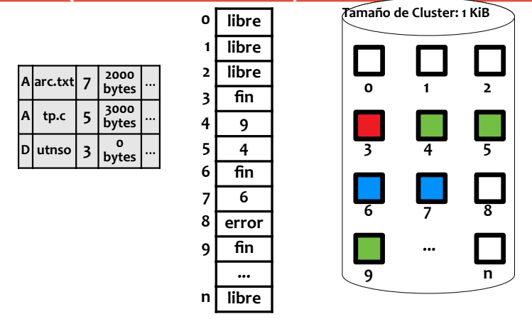

# 08 - File System

## Objectives

- Data storage and manipulation
- Multi-user support (protection)
- Minimize possible data lost
- Maximize system performance
  - OS: space management
  - User: response time
- Multi-device support
- Guarantees data integrity and coherence

## File

> A file is bytes with meaning

A file system is a specification of _How_ files are stored, and which operations can be done over those data files.

Then an implementation is a _program_ which knows that _specification_.

### Attributes

> Metada

- Name\*
- Size
- Id (inode)
- Permits
- Type
- Dates
- Location
- Owner

> NOTE: Name is Location

### Operations

#### Basics

- Create
- Delete
- Open
- Close
- Read
- Write
- Rename
- Reposicioante
- Trunk

#### Combined

- Copy
- Rename (move)

### Openning

- Mode
- Open Files Global Table
- Process' Open File Table

### Block & Locks

A process can `lock` a part of the file, and other process can use another part (not locked) from the same file.

```cpp
void process1(){
  // Lock from Byte 0 to Byte 100
  lock(a.txt, 0, 100);
  operate(a.txt)
  unlock(a.txt);
}

void process2(){
  // Lock from Byte 200 to Byte 300
  lock(a.txt, 200, 300);
  operate(a.txt)
  unlock(a.txt);
}
```

- Shared

```cpp
void process1(){
  // Allows sharing file ONLY for Reading
  lock(a.txt, SHARED, READING);
  operate(a.txt)
  unlock(a.txt);
}

void process2(){
   // Allows sharing file ONLY for Writting
  lock(a.txt, SHARED, WRITTING);
  operate(a.txt)
  unlock(a.txt);
}
```

- Exclusive
- Suggested
- Obligatory

```cpp
void process1(){
  lock(a.txt);
  write(a.txt)
  unlock(a.txt);
}

void process2(){
  write(a.txt);
  // Does throw FAILURE
}
```

### Paths

#### Absolute

Example: `/home/utnso/README.md`

#### Relative

Relative to `Working directory`.

## Mount Point

Refers to make available certain files to the system.

## Protection

- Total Access
  - _No_ protection
- Restringed Access
  - File has owner
- Controlled Access (permissions)
  - Not only has owner (or group), but also differents permissions
  - Access Matrix
  - Access Control List
  - Passwords

## Logic Disk



Minimum unit of lecture/writting in a magnetic disk is a **`sector`**, in a _Logic Disk_ it is a **`Block`**

### Partitions



```
Storage devices
```

### Volume



## Structure

- Booting block
- File Control block (FCB)
- Volume control block
- Directory structure
  - Directory entries: file names + attributes or FCB pointer

### Memory Structures

- Mounting Table
- Directories structures
- Open Files Global Table (or List)
- Process Open Files Table (or List)

### Directories Implementation

- Lineas list
- Ordered list
- Tree
- Hash table

### Assignment methods

```c
#include <stdio.h>
#include <stdlib.h>
#include <pthread.h>
#include <unistd.h>

void my_function(int *numero);
int g_var;

int main(void) {
  int i;
  int threads = 10;
  g_var = 0;

  pthread_t tid[threads][2];

  for (i = 0; i < threads; i++) {
    tid[i][1] = i+1;
    pthread_create(&tid[i][0], NULL, (void*)my_function, &tid[i][1]);
  }

  // Await all threads to end

  for (i = 0; i < threads; i++) {
    pthread_join(tid[i][0], NULL);
  }
  return EXIT_SUCCESS;
}
```

## File Allocation System (FAT)

- Directories contain a file list and included directories

```
File Type | Name & Extension | First Clauster | File | ...
```

### Table



- FAT12: 12-bit pointers
- FAT16: 16-bit pointers
- FAT32: 32-bit pointers (28 usable)

> Exercise Example
>
> - FAT32
> - CLuster Size 2 KB
> - MAX FileSystem size (theorically) = `2^28` \* `2^11` = `2^39` = `512GB`
> - Max Fs size (Real with 500gb Disk) = `500GB`
> - Max Fs size (Real with 1TB Diks) = `512GB`

> NOTE:
