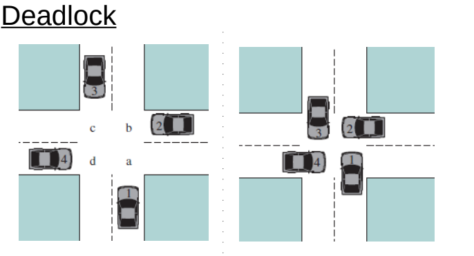
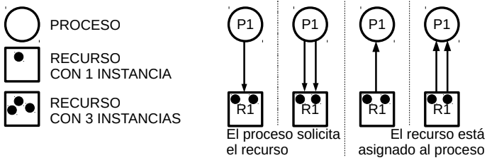
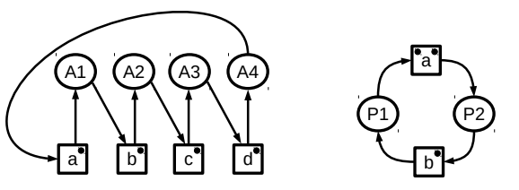
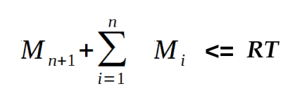

# 09 - Deadlock

## Introduction

- Limited resources (CPU, Memory, Devices, etc)
- Processes
  - Request
  - Use
  - Free
- Unavailable resource, process can block itself



```c
void car1(void){
   wait(a);
   wait(b);

   execute();

   signal(a);
   signal(c);
}

void car2(void){
   wait(b);
   wait(c);

   execute();

   signal(b);
   signal(c);
}

void car3(void){
   wait(c);
   wait(d);

   execute();

   signal(c);
   signal(d);
}

void car4(void){
   wait(d);
   wait(a);

   execute();

   signal(d);
   signal(a);
}
```

## Definition

> Permanent blocking of a set of processes
> where each of these processes is waiting
> an event that can only generate a process of the set.

## Resources

### Types

- Reusable
- Consumable

### Asignment

#### Graph

> It allows to represent the state of the system with respect to
> allocation of resources to each process at a specific time



##### Cycles

- No cycle, no deadlock
- A cycle MAY imply deadlock existance
- A cycle and all resources have only one instance, then there is deadlock



## Existance Condition

### Necessary condition

- Mutual exclusion
- Hold and waiting
- No resource preemptiveness

### Necessary and sufficient condition

- Circular waiting

> NOTE: All 4 at the same time

## Treatments

### Prevention

- Guarantees NO deadlock scenary
- Prevent one of
  1. Mutual-Exclusion
  2. Hold and Waiting
  3. No resource preemptiveness
  4. Circular Waiting

#### Mutual Exclusion

- With no sharable resources, it cannot be prevented

#### Hold and Wait

- Request all resources
- On-demand delivery and release

#### No resource preemptiveness

- When a process requests unavailable resources, they must be released to be used.
- When process `A` request resources which have been assigned to process `B`, which is waiting for more resources. Resources can be reassigned to `A`

#### Circular Waiting

- Establish a resource order to be assigned

### Deadlock Prediction

- Guarantees no Deadlock
- Techniques
  - Deny process initiation
  - Deny resource assignment

#### Deny Initiation



```
Mi = Maximium necessities declared by process i
n = Actual number of processes
RT = Total system Resources
```

#### Banker Algorithm

- Secure State: Occurs no deadlock
  - Assign resource to process
- Insecure State: Deadlock may occur
  - Do not assign resource to process

System Status

- Maximum Necessity Matrix
- Assigned Resources Matrix
- Total Resources Vector
- Availabe Resources Vector

```
Pending Neccessities = Maximum Necessities - Assigned Resources
```

- A simulation of resource assignment is run, applying Banker's Algorithm

### Detection and Recovering

- Deadlock may occur
- No restrictions for resource assignments
- A detection algorithm is run periodically

#### Recover Options

- Terminate involved processes
- Process step back to previous state
- Terminate any involved process until deadlock stops
- Expropriate resources unti deadlock stops
