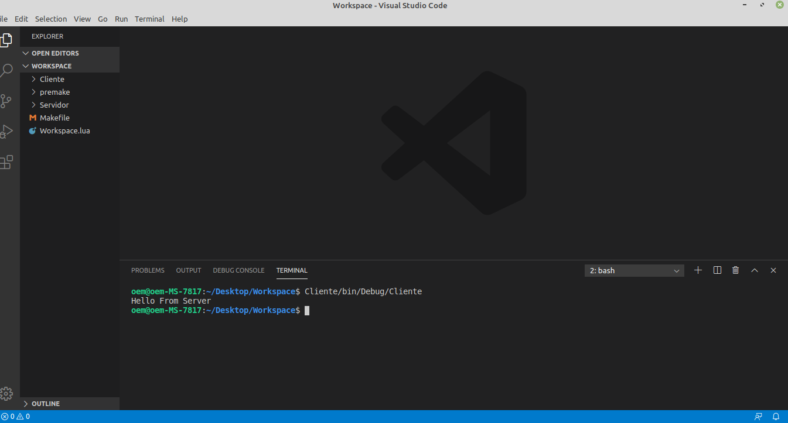
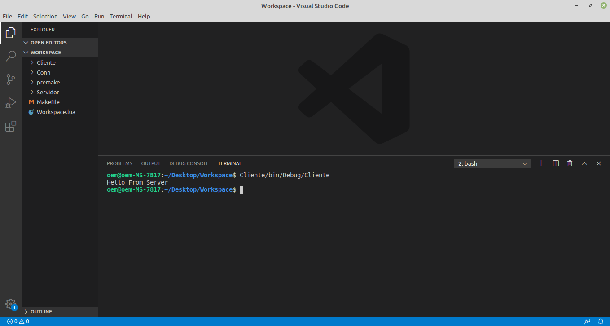

#   ¿Como usar Premake?

##  Workspace

Vamos a armar un programa simple en C para generar una conexión configurandolo con premake. En C/C++ (y en la mayoría de los lenguajes) existen lo que se conocen como **_workspaces_** (o **_soluciones_** como le gusta llamarlo a microsoft) que conforman un conjunto de proyectos.

Entonces, lo primero que se debe hacer es crear el workspace donde vamos a tener nuestro/s proyectos (el nombre puede ser cualquiera):

  

Dentro de nuestro workspace creamos un script con extensión .lua que va a tener la configuración de nuestro workspace (que van a ser comunes a todos nuestros proyectos):

  

Los script de premake tienen una serie de reglas que son las que van a seguir cuando se ejecuten. Existen muchas reglas, pero por el momento solamente vamos a usar algunas:

  *   `workspace`: Especifica el nombre del workspace o solución. Se puede usar también `solution`. Ambas cumplen el mismo rol.
  
  *   `configurations`: Lista de configuraciones que van a tener los proyectos. Generalmente siempre son dos valores. **_Debug_** y **_Release_** (aunque se pueden agregar los que se quieran con los nombres que quieran).
  *   `architecture`: La arquitectura a la que se va a compilar. Generalmente las opciones son **_x86_** (32 bits) y **_x86_64_** (64 bits).
  
  *   `cdialect`:  No es necesaria especificarla. Se usa para decidir bajo que estándar de C se va a compilar (ANSI C o C 89, C 99, C 11). Las opciones válidos son: **_GNU89_**, **_GNU99_**, **_GNU11_**, **_C89_**, **_C99_**, **_C11_**. Los valores con GNU se deben especificar si o si para el compilador de gcc.
  
  *   `include`:  Incluye un nuevo proyecto dentro del worskpaces. Se coloca la ruta al script de premake del proyecto en cuestión.

En este ejemplo, el script del workspace quedaria algo asi:

  

##  Creando un proyecto

Dentro del workspace vamos a tener un montón de proyectos que, se suponen, están relacionados (como en el tp de Delibird). Vamos a crear el proyecto Cliente:

  
  
No hay una manera específica para acomodar los archivos de C. Pero la manera que encuentro mas comoda es creando dos carpetas: **_src_** e **_include_**:

  
  
En src irían todos los .c (los archivos de C que se compilan). Mientras que en la carpeta de include estarán todos los .h. El proyecto cliente con el codigo quedaria de la siguiente manera:
  
  
  
En el main tendríamos el siguiente código:
  
  
  
Todas las funciones de conexión se encuentran declaradas dentro de conn.h, y definidas en conn.c. Por lo tanto, tenemos que especificarle al compilador en qué directorios se encuentran nuestros .h y que archivos de C tiene que compilar.

Antes de ver el script, vamos a ver un par de reglas importantes que se necesitan:

*   `project`: Especifica el nombre del proyecto.
 Ejemplo-Premake
*   `kind`: Especifica el tipo de proyecto. Puede ser uno de **_ConsoleApp_**, **_StaticLib_**, **_SharedLib_**.

*   `location`: El directorio donde se encuentra nuestro proyecto.

*   `targetdir`: Especifica el directorio donde se colocaran los resultados de la compilación (los binarios).

*   `objdir`: Directorio donde se colocaran la compilación individual de cada uno de los .c.

*   `includedirs`: Directorios donde el compilador buscará los .h.

*   `files`: Archivos .c que se van a compilar.

*   `filter`: Aplica reglas según qué filtro se utilice.

Todas estas reglas las pueden buscar en [premake](https://github.com/premake/premake-core/wiki) si quieren profundizar en alguna en específico.

Para facilitar más las cosas, y poder personalizar la configuración de cada proyecto de forma homogénea, existen una serie de **_macros_** o **_tokens_**(como se llaman en la wiki de premake):

*   `%{wks.location}`: Se reemplaza por la ruta al directorio del workspace.

*   `%{prj.name}`: Se reemplaza por el nombre del proyecto.

*   `%{prj.location}`: Se reemplaza por la ruta al directorio del proyecto.

*   `%{cfg.buildcfg}`: Se reemplaza por la configuración activa (Debug o Release en nuestro caso).

Con esto, el script de premake para el proyecto cliente quedaría de la siguiente manera:

  
  
##    Creando el Servidor

De igual manera que hicimos con el cliente, vamos a crear el servidor. Creamos una carpeta para nuestro nuevo proyecto y armamos las carpetas que necesitamos:

  
  
El proyecto Servidor con el código quedaría de la siguiente manera:
  
  
  
En el main tendríamos el siguiente código:

  
  
De nuevo, todas las funciones de conexión se encuentran declaradas en conn.h y definidas en conn.c.

El script de premake de este proyecto queda prácticamente igual que el del cliente, con la diferencia que cambiaríamos el nombre del proyecto:

  
  
Esto gracias a las macros que provee premake.

##    Generar los Makefile

Una vez que ya tenemos todos nuestros script listos, tenemos que ejecutar premake. Para eso, deben conseguir el binario de premake, que está en el repositorio de Delibird, o pueden usar el que esta en este repo. De nuevo, no hay una manera exacta de organizar las cosas dentro del workspace, pero para que el directorio quede lo más “limpio” posible, creamos una carpeta que se llame premake donde vamos a colocar el binario:

  
  
En Visual Studio Code, haciendo **_ctrl + shift + p_** y escribiendo Terminal Integrado podremos abrir un terminal dentro del editor:

  
  
  
  
Una vez en el directorio, ejecutamos lo siguiente:
  
  
  
La opción **_--file_** especifica el script de premake a ejecutar. **_gmake_** indica que queremos crear un proyecto de makefile.

Una vez ejecutado el script, el directorio debería quedar de la siguiente manera:

  
  
Ahora solo queda ejecutar make. Si estamos parados en el directorio principal del workspaces y ejecutamos make, se van a compilar todos los proyectos del directorio:

  
  
Si quisiéramos compilar solamente un proyecto en específico, nos movemos al directorio del proyecto y ejecutamos make. Eso evita que se compilen todos los proyectos:

  
  
Anteriormente, en los script de nuestros proyectos, especificamos que los resultados de compilación se coloquen bajo los siguiente directorio:

  
  
Por lo que, si nos fijamos en los directorios de nuestros proyectos, vamos a encontrar las carpetas bin y obj con los resultados de compilación:

  

  
  
No es una manera muy limpia de colocar los binarios, pero es la forma por default que los hacen, por ejemplo, IDEs como codeblocks o codelite

##    Ejecutando los programas

Finalmente, vamos a ejecutar los programas cliente y servidor. Para eso, tenemos que movernos a los directorios y ejecutar los programas, o podemos, parados en el workspace, ejecutarlos de la siguiente manera:

  
  
  
El primer programa que debemos ejecutar es el programa servidor para que quede a la escucha de una conexión:

  
  
Podemos abrir otra consola apretando el símbolo + en la consola de Visual Studio Code:
  
  
  
En la otra consola ejecutamos el cliente:

  
  
El servidor responde con el _“Hello From Server”_. Si revisamos la consola del servidor, vamos a ver que tambien recibio un mensaje _“Hello From Client”_ que le envió el cliente:

  
  
##    Crear una SharedLib y linkear los proyectos

Una última cosa que podemos hacer es crear una librería para las conexiones. Tanto cliente como servidor tienen algunas funciones en común, como `send_data` o `recv_data`. Para eso, creamos un nuevo proyecto, llamado Conn, donde vamos a tener todas las funciones necesarias para crear un servidor y conectar un cliente:

  
  
El script de esta librería, de nuevo, va a ser muy similar al de los otros dos proyectos, con la diferencia que, esta vez, el tipo de proyecto va a ser _SharedLib_:

  

Como ahora vamos a usar esta librería en los otros proyectos, debemos cambiar un par de cosas en los scripts del proyecto Cliente y del Servidor para poder utilizar la librería:

  
  
  
  
Agregamos un nuevo directorio de includes en los proyectos Clientes y Servidor para que busquen los .h del proyecto Conn. También agregamos la regla `links`, que especifica que debemos linkear con la librería Conn.

Finalmente, en nuestro workspace debemos incluir nuestro nuevo proyecto:

  
  
Debemos hacerlos antes de los proyectos que dependen de él para que se puedan generar las reglas correctamente.

Hecho esto, debemos ejecutar nuevamente premake para generar los nuevos makefiles:

  
  
Ahora solo queda compilar los proyectos usando make y probar los proyectos:

  
  
Ejecutamos el servidor:
  
  
  
Y ejecutamos el cliente:
  
  
  
Resultado en el servidor:

  
